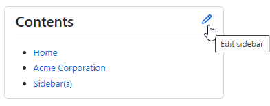
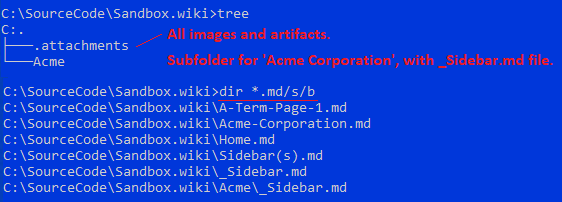

# Introduction
The default `Pages` widget that just lists every page seems too simplistic for all but a trivial Wiki. Similarly, [Creating a footer or sidebar for your wiki](https://docs.github.com/en/communities/documenting-your-project-with-wikis/creating-a-footer-or-sidebar-for-your-wiki#creating-a-sidebar) is unsatisfactorily simplistic.

💀 Using [this as my reference (ToC or Sidebar in GitHub Wiki)](https://stackoverflow.com/questions/9239588/toc-or-sidebar-in-github-wiki/25304429#25304429) I was optimistic about providing a useful, per subfolder sidebar. However it doesn't seem to work:
   1. Notice how, when you navigate to the [[Acme Corporation]] page, its custom sidebar is not used.
   1. Notice how, when you edit the Sidebar from ANY page, you get the [[Acme Corporation]] sidebar's content, not the '_root sidebar_.'
      - 

## Test Setup
- 

### C:\SourceCode\Sandbox.wiki\_Sidebar.md

```md
# Contents
- [[Home]]
- [[Acme Corporation]]
- [[Sidebar(s)]]
```

### C:\SourceCode\Sandbox.wiki\Acme\_Sidebar.md
```md
# Contents
- [[Home]]
```
